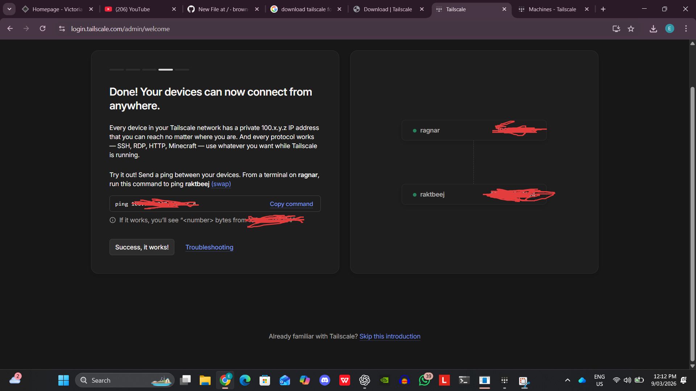
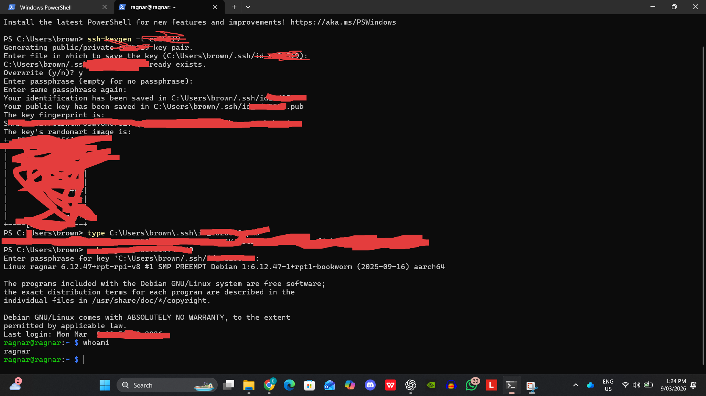

# Tailscale Remote Access Lab

# Objective

The goal of this lab was to set up secure remote access to my Raspberry Pi so I can connect to it from outside my home network (for example from university). 

Instead of opening ports on the router, I used Tailscale to create a secure private network between my laptop and the Raspberry Pi.

---

# Tools Used

- Raspberry Pi 4
- Raspberry Pi OS
- Tailscale
- SSH

---

# Why I Built This

Normally, devices inside a home network cannot be accessed directly from outside networks.

For example, if my Raspberry Pi is running at home, I cannot just SSH into it from university because the router blocks external connections.

Tailscale solves this by creating a secure private network (mesh VPN) between devices. Once both devices join the same Tailscale network, they can communicate securely from anywhere.

This allows the Raspberry Pi to function like a small server that I can manage remotely.

---

# Installation Steps

1. Updated system packages
     - sudo apt update
     
2. Installed Tailscale
     - curl -fsSL https://tailscale.com/install.sh| sh

3. Started Tailscale
     - sudo tailscale up
  
4. Logged into the Tailscale account through the browser authentication page.

---

# Verifying the Setup

After logging in, the Raspberry Pi was assigned a Tailscale IP address.

Example format:
ssh ragnar@100.x.x.x

⚠️ Note: The real IP address is hidden for security.

To test the connection, I connected to the Raspberry Pi using SSH from another device:

The connection worked successfully from another network.

---

# Network Concept

Without Tailscale

Laptop (University Network)  
↓  
Internet  
↓  
Home Router  
↓  
Raspberry Pi (not reachable)

With Tailscale

Laptop  
↓  
Encrypted Tailscale Tunnel  
↓  
Raspberry Pi

Both devices join the same private network, allowing secure communication regardless of location.

---

## Screenshots

# What I Learned

- How remote access works in home networks
- Why routers normally block incoming connections
- How VPN-based networking tools like Tailscale simplify remote server access
- Basic server management using SSH
- Used authentication keys so password entry is not required..

---

# Future Improvements

- Set up automatic startup for services
- Add monitoring tools for the Raspberry Pi

